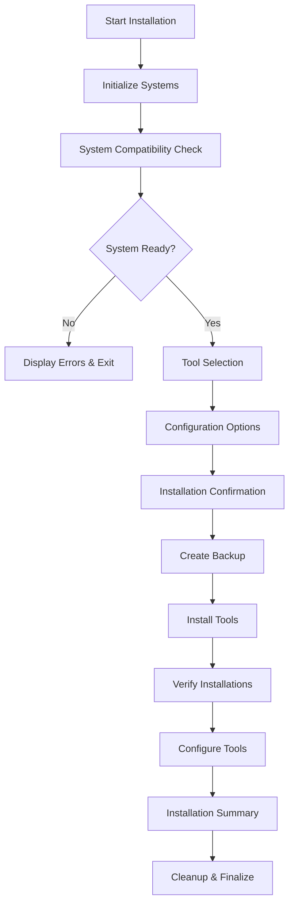
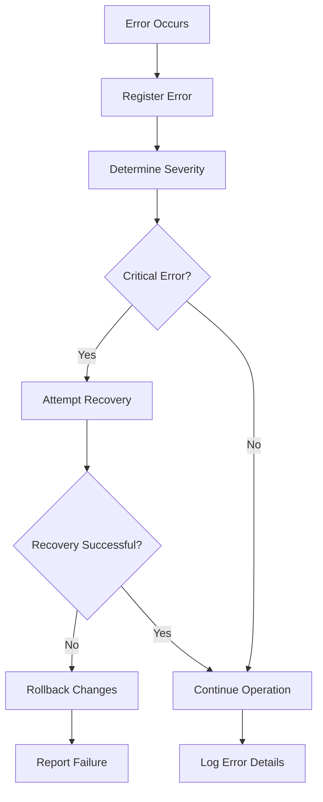
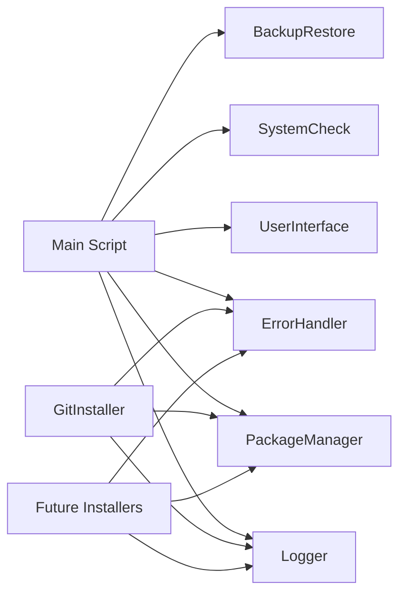

# Architecture Documentation

This document describes the system architecture, design decisions, and technical implementation details of the Windows Terminal & PowerShell Setup project.

## 🏗️ System Overview

The Windows Terminal & PowerShell Setup is designed as a modular, extensible PowerShell-based installation system with the following key characteristics:

- **Modular Architecture**: Separation of concerns through dedicated modules
- **Cross-Platform Compatibility**: Works across PowerShell 5.1 and 7+
- **Multiple Package Manager Support**: Abstraction layer for winget, chocolatey, and scoop
- **Enhanced User Experience**: Interactive UI with progress tracking and error handling
- **Enterprise-Ready**: Comprehensive logging, error handling, and recovery mechanisms

## 🎯 Design Principles

### 1. Modularity and Separation of Concerns
Each module has a single, well-defined responsibility:
- **Core modules**: Provide fundamental functionality (logging, UI, system checks)
- **Installer modules**: Handle tool-specific installation logic
- **Configurator modules**: Manage configuration and customization

### 2. Fail-Safe Operation
- **Graceful degradation**: System continues to function even if non-critical components fail
- **Comprehensive error handling**: All operations include proper error handling and recovery
- **Backup and restore**: Automatic backup of configurations before changes

### 3. User-Centric Design
- **Interactive experience**: Rich UI with progress tracking and user feedback
- **Customization options**: User control over tool selection and configuration
- **Clear communication**: Detailed progress updates and comprehensive summaries

### 4. Extensibility
- **Plugin architecture**: Easy addition of new tool installers
- **Configuration flexibility**: Support for different themes, fonts, and options
- **Package manager abstraction**: Easy addition of new package managers

## 📦 Module Architecture

### Core Module Layer

```
Core/
├── Logger.psm1              # Centralized logging system
├── UserInterface-Simple.psm1 # UI components and user interaction
├── SystemCheck.psm1         # System validation and diagnostics
├── PackageManager.psm1      # Package manager abstraction
├── BackupRestore.psm1       # Configuration backup/restore
└── ErrorHandler.psm1        # Error handling and recovery
```

#### Logger Module
**Purpose**: Centralized logging with multiple output targets and severity levels

**Key Features**:
- File-based logging with timestamps
- Multiple severity levels (Debug, Info, Warning, Error, Success)
- Console output with color coding
- Session management with start/stop functionality

**Design Decisions**:
- Single global logger instance to avoid conflicts
- Configurable log levels for different environments
- Automatic log file rotation and cleanup

#### UserInterface Module
**Purpose**: Enhanced user experience with interactive components

**Key Features**:
- ASCII-based progress bars compatible across terminal types
- Interactive menus with validation
- Step-by-step wizard flow
- Professional formatting and color coding

**Design Decisions**:
- ASCII characters instead of Unicode for maximum compatibility
- Fallback mechanisms for environments without UI support
- Modular UI components for reusability

#### SystemCheck Module
**Purpose**: Comprehensive system validation and compatibility checking

**Key Features**:
- Operating system version validation
- PowerShell version compatibility checks
- Internet connectivity testing
- Package manager availability detection
- Disk space and permission validation

**Design Decisions**:
- Non-blocking validation with warnings vs. critical errors
- Detailed diagnostic information collection
- Extensible validation framework for new requirements

#### PackageManager Module
**Purpose**: Abstraction layer for multiple package managers

**Key Features**:
- Unified interface for winget, chocolatey, and scoop
- Automatic package manager detection and selection
- Timeout handling and retry logic
- Installation verification and rollback

**Design Decisions**:
- Priority-based package manager selection (winget > choco > scoop)
- Consistent return objects across all package managers
- Isolated execution to prevent conflicts

### Installer Module Layer

```
Installers/
├── GitInstaller.psm1        # Git-specific installation and configuration
├── PowerShellInstaller.psm1 # PowerShell 7 installation (future)
├── TerminalInstaller.psm1   # Windows Terminal installation (future)
└── ToolInstaller.psm1       # Generic tool installer (future)
```

#### GitInstaller Module
**Purpose**: Specialized Git installation with enhanced configuration

**Key Features**:
- Git installation with multiple package manager support
- User configuration setup (name, email)
- Installation verification with functional testing
- Retry logic with exponential backoff

**Design Decisions**:
- Separate module for complex tools requiring special handling
- Comprehensive post-installation validation
- User-friendly configuration prompts

### Configuration Layer

```
Configurators/
├── TerminalConfigurator.psm1 # Windows Terminal theme and settings (future)
├── ProfileConfigurator.psm1  # PowerShell profile setup (future)
└── FontConfigurator.psm1     # Font installation and configuration (future)
```

## 🔄 Data Flow Architecture

### Installation Flow



### Error Handling Flow



### Module Interaction



## 🛠️ Technical Implementation Details

### PowerShell Version Compatibility

**Challenge**: Supporting both PowerShell 5.1 and 7+ with different capabilities

**Solution**:
- Feature detection instead of version checking
- Graceful degradation for advanced features
- Consistent API across versions

```powershell
# Example compatibility pattern
if ($PSVersionTable.PSVersion.Major -ge 7) {
    # Use PowerShell 7+ features
    $result = Invoke-RestMethod -Uri $url -TimeoutSec 30
} else {
    # Fallback for PowerShell 5.1
    $result = Invoke-WebRequest -Uri $url -UseBasicParsing -TimeoutSec 30
}
```

### Package Manager Abstraction

**Challenge**: Different package managers with varying APIs and behaviors

**Solution**:
- Unified interface with consistent return objects
- Manager-specific implementations with common patterns
- Automatic fallback and retry logic

```powershell
# Unified package installation interface
function Install-Package {
    param($PackageName, $PreferredManager)
    
    $managers = Get-AvailablePackageManagers
    $selectedManager = $managers | Where-Object Name -eq $PreferredManager | Select-Object -First 1
    
    if (-not $selectedManager) {
        $selectedManager = $managers | Select-Object -First 1
    }
    
    return Invoke-PackageInstallation -Manager $selectedManager -Package $PackageName
}
```

### Error Handling Strategy

**Challenge**: Providing meaningful error messages and recovery options

**Solution**:
- Hierarchical error classification (Critical, High, Medium, Low)
- Context-aware error messages with suggested actions
- Automatic recovery attempts for common issues

```powershell
# Error handling pattern
try {
    $result = Install-Package -PackageName $tool
} catch {
    $errorInfo = @{
        Tool = $tool
        Error = $_.Exception.Message
        Context = Get-InstallationContext
        Suggestions = Get-RecoverySuggestions -Error $_.Exception
    }
    
    Register-Error -ErrorInfo $errorInfo
    
    if ($errorInfo.Suggestions.AutoRecovery) {
        Invoke-AutoRecovery -ErrorInfo $errorInfo
    }
}
```

### UI Rendering System

**Challenge**: Creating rich UI experiences in PowerShell console

**Solution**:
- ASCII-based graphics for maximum compatibility
- Color coding with fallbacks for limited terminals
- Progressive enhancement based on terminal capabilities

```powershell
# Progress bar rendering
function Show-ProgressBar {
    param($Current, $Total, $Width = 50)
    
    $percentage = [math]::Round(($Current / $Total) * 100, 1)
    $filled = [math]::Round(($percentage / 100) * $Width)
    $empty = $Width - $filled
    
    $bar = "#" * $filled + "-" * $empty
    Write-Host "[$bar] $percentage%" -ForegroundColor Green
}
```

## 🔐 Security Considerations

### Execution Policy Handling
- Minimal required permissions
- User-scoped policy changes when possible
- Clear documentation of security requirements

### Package Verification
- Package signature validation where available
- Checksum verification for downloads
- Source repository validation

### Configuration Security
- Secure storage of sensitive configuration
- Minimal privilege principle
- Audit trail for configuration changes

## 📊 Performance Considerations

### Startup Performance
- Lazy loading of modules
- Minimal initial dependencies
- Fast system compatibility checks

### Installation Performance
- Parallel installation where safe
- Progress tracking for long operations
- Timeout handling for network operations

### Memory Management
- Proper variable scoping
- Module cleanup after use
- Efficient data structures

## 🔮 Future Architecture Considerations

### Planned Enhancements

1. **Plugin System**: Dynamic loading of tool installers
2. **Configuration Profiles**: Predefined installation profiles for different use cases
3. **Remote Configuration**: Support for centralized configuration management
4. **Telemetry System**: Optional usage analytics and error reporting
5. **Update Mechanism**: Automatic script updates and tool maintenance

### Scalability Considerations

1. **Enterprise Deployment**: Support for mass deployment scenarios
2. **Configuration Management**: Integration with existing IT management tools
3. **Customization Framework**: Easy customization for organizational needs
4. **Monitoring Integration**: Support for enterprise monitoring systems

### Technology Evolution

1. **PowerShell 7+ Migration**: Gradual migration to PowerShell 7+ features
2. **Windows Package Manager**: Increased reliance on winget as it matures
3. **Container Support**: Potential support for containerized development environments
4. **Cloud Integration**: Integration with cloud-based development tools

## 📝 Design Decisions Log

### Decision 1: Module-Based Architecture
**Date**: 2024-01-15
**Decision**: Use PowerShell modules for separation of concerns
**Rationale**: Enables code reuse, testing, and maintenance
**Alternatives Considered**: Monolithic script, function libraries
**Status**: Implemented

### Decision 2: ASCII-Based UI
**Date**: 2024-01-20
**Decision**: Use ASCII characters for UI elements instead of Unicode
**Rationale**: Maximum compatibility across terminal types and PowerShell versions
**Alternatives Considered**: Unicode characters, HTML-based UI
**Status**: Implemented

### Decision 3: Package Manager Abstraction
**Date**: 2024-01-25
**Decision**: Create abstraction layer for multiple package managers
**Rationale**: Flexibility and user choice, fallback options
**Alternatives Considered**: Single package manager requirement
**Status**: Implemented

### Decision 4: Comprehensive Error Handling
**Date**: 2024-01-30
**Decision**: Implement hierarchical error handling with recovery
**Rationale**: Enterprise-grade reliability and user experience
**Alternatives Considered**: Basic error reporting
**Status**: Implemented

## 🔗 Related Documentation

- **[API Documentation](API_DOCUMENTATION.md)** - Detailed function reference
- **[Contributing Guide](CONTRIBUTING.md)** - Development guidelines
- **[Installation Guide](INSTALLATION_GUIDE.md)** - User installation instructions
- **[Troubleshooting Guide](TROUBLESHOOTING.md)** - Common issues and solutions

---

*This architecture documentation is maintained alongside the codebase and updated with significant changes.*
